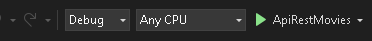

<p align="center">
  
</p>
<h1 align="center"> .NET</h1>

<p align="center">
  <a title="Twitter: Jose_leonardo" href="https://www.linkedin.com/in/jose-leonardo-poveda/">
    
  </a>  
  <a title="Github: Sponsors" href="https://github.com/shiwirockztar">
    
  </a>
  <br />
  <br />
</p>

## 🔖 Description

- ** Create a RESTful API that provides endpoints for:**
- ** User registration.**
- ** User login.**
- ** Get a list of popular movies from the public movie API.**
- ** Search movies by title from the Movies public API.**
- ** Get movie details by movie ID from the public movie API.**
- ** Store user information and saved movies in a database.**

ApiRestMovies is a web application developed in .Net that provides users with an interactive experience to discover and explore information about movies. The application uses the Movie API "ApiRestMovies" from folder Backend (.Net Core) to get up-to-date data on popular movies, upcoming releases and movie-specific details.

Official Documentation: [DotNet | API ](https://learn.microsoft.com/en-us/dotnet/)
Official Documentation: [Swagger | REST API documentation](https://www.youtube.com/watch?v=RayDPBYou4I)

## ✅ Prerequisites

In order to work with this project, your local environment must have at least the following versions:

- Visual Studio Code 2022
- Dotnet core 6

## 📐 How to work with this project

You have to do the following steps to be able to work with this project.

### 1️⃣ Open visual studio code 2022

_To work with this project locally it is necessary to log in to the solution project._

```
Select -> File  -> Open-> Project or solution.
```

_**Within the project to search for ApiRestMovies.sln.**_

### 2️⃣ Run

To run the backend application, after accessing the project solution we select the run button and press play.



### Creating executable

To create an executable in .net we need to execute the list of steps seen in the `video`. Programando en C# con Visual Studio .NET #30 - Cómo crear un instalador y un ejecutable (.exe) [youtube](https://www.youtube.com/watch?v=DPxdVKKmrzo&t=548s).

## 📂 Code scaffolding

```any
/
├── ApiRestMovies 📁        # Backend aplication folder.
|   └── ApiRestMovies.sln   # Solution project.
|   |
|   ├── ApiRestMovies 📦    # Main app client.
|   |   ├── Controllers     # Controllers of the api.
|   |   └── program.cs      # Main structure of the project deployment.
|   |
|   ├── ApiRestMovies.Data  # Repositories and interfaces.
|   └── ApiRestMovies.Model # Models.
|
├── assets 🌈               # Images sources.
├── Readme  📝              # Project information and instructions.
└── ...
```

## Happy Code

Created with JavaScript, lot of ❤️ and a few ☕️

## This README.md file has been written keeping in mind

- [GitHub Markdown](https://guides.github.com/features/mastering-markdown/)
- [Emoji Cheat Sheet](https://www.webfx.com/tools/emoji-cheat-sheet/)
