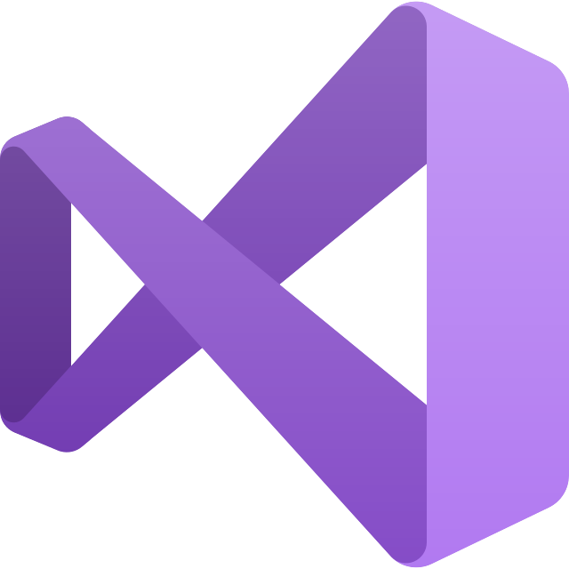
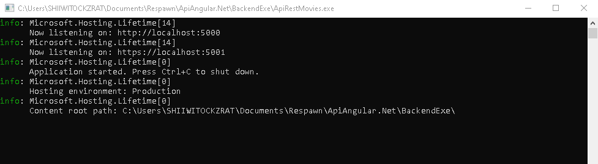

<p align="center">
  
</p>
<h1 align="center">Project Angular .Net and SQL</h1>

<p align="center">With this challenge we by means of this application we build a client to watch movies.</p>

<p align="center">
  <a title="Twitter: Jose_leonardo" href="https://www.linkedin.com/in/jose-leonardo-poveda/">
    
  </a>  
  <a title="Github: Sponsors" href="https://github.com/shiwirockztar">
    
  </a>
  <br />
  <br />
</p>

## 🔖 Description

executable of an api for windows, which allows us to run the application without using visual studio code 2022

## ✅ Prerequisites

In order to work with this project, your local environment must have at least the following versions:

- windows

## 📐 How to work with this project

inside the BackendEXE folder you will find a file with the name "ApiRestMovies", when you double click on it the application will start automatically.

### Run

To run ApiRestMovies.exe, a window will appear showing the status and the path where the server is running.



## 📂 Code scaffolding

```any
/
├── assets 🌈               # Images Sources.
├── ApiRestMovies.exe 📦    # Main App-Exe Server.
├── Readme                  # project description file.
└── ...
```

## Happy Code

Created with JavaScript, lot of ❤️ and a few ☕️

## This README.md file has been written keeping in mind

- [GitHub Markdown](https://guides.github.com/features/mastering-markdown/)
- [Emoji Cheat Sheet](https://www.webfx.com/tools/emoji-cheat-sheet/)
