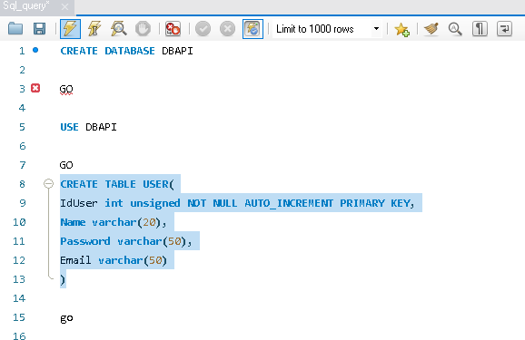

<p align="center">
  
</p>
<p align="center">
  
</p>
<h1 align="center"> SQL</h1>

<p align="center">
  <a title="Twitter: Jose_leonardo" href="https://www.linkedin.com/in/jose-leonardo-poveda/">
    
  </a>  
  <a title="Github: Sponsors" href="https://github.com/shiwirockztar">
    
  </a>
  <br />
  <br />
</p>

## 🔖 Description

- Use a database (Sql Server) to store user information and the movies saved by each user.
  movies saved by each user.

This project is intended to store and manage user interactions, including the movies they have saved. Within this repository, you will find the scripts and resources needed to manage the database using SQL.

Official Documentation: [Angular | Front](https://docs.angular.lat/docs)

## ✅ Prerequisites

In order to work with this project, your local environment must have at least the following versions:

- MySql.

## 📐 How to work with this project

You have to do the following steps to be able to work with this project.

### 1️⃣ Open MySQL Workbench

To work with this project locally it is necessary MySQL.

### 2️⃣ Run

To run the Sql script,you need to follow these steps.

Select -> File -> Open SQL script -> Sql_query.sql.

```
CREATE DATABASE DBAPI

GO

USE DBAPI

GO
CREATE TABLE USER(
IdUser int unsigned NOT NULL AUTO_INCREMENT PRIMARY KEY,
Name varchar(20),
Password varchar(50),
Email varchar(50)
)

go

CREATE TABLE MOVIE(
IdMovie int unsigned NOT NULL AUTO_INCREMENT PRIMARY KEY,
IdApi int,
Title varchar(50),
Description varchar(300),
IdUser int unsigned,
FOREIGN KEY (IdUser) REFERENCES USER(IdUser)
)

insert into USER(Name,Password,Email) values
('Shiwirockztar','a','shiwirockztar@gmail.com'),
('Cinefilo','1234567','Cinefilor@hotmail.com')

insert into MOVIE(IdApi,Title,Description,IdUser) values
(278,'The Shawshank Redemption','Dos hombres encarcelados se unen durante varios años, encontrando consuelo y eventual redención a través de actos de decencia común.',1)


SELECT * FROM MOVIE

SELECT * FROM USER
```

### 3️⃣ To run need:

Be sure to run these scripts in order to configure the database correctly.


_**Step by step.**_



## 📂 Code scaffolding

```any
/
├── Sql_query.sql 📁        # Sql script.
├── assets 🌈               # Images sources.
├── Readme  📝              # Project information and instructions.
└── ...
```

## Happy Code

Created with JavaScript, lot of ❤️ and a few ☕️

## This README.md file has been written keeping in mind

- [GitHub Markdown](https://guides.github.com/features/mastering-markdown/)
- [Emoji Cheat Sheet](https://www.webfx.com/tools/emoji-cheat-sheet/)
