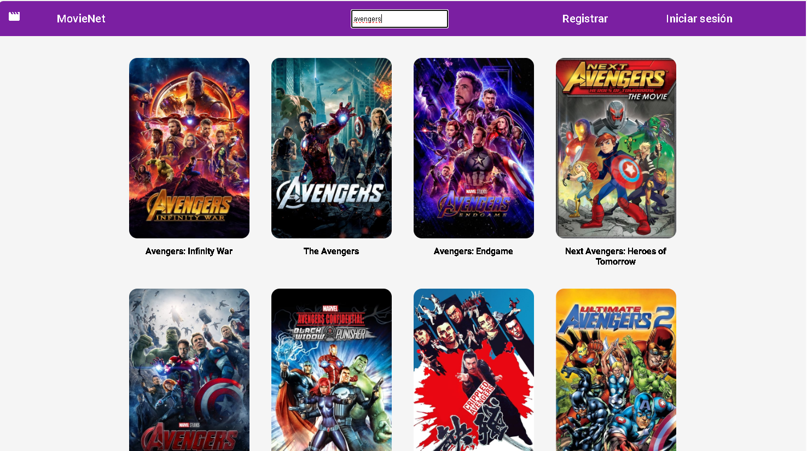
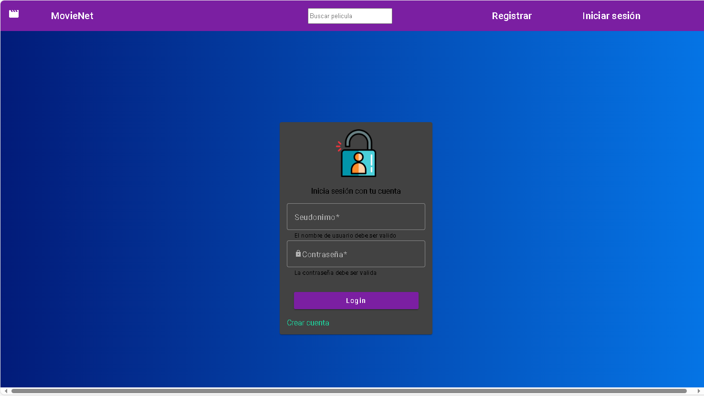
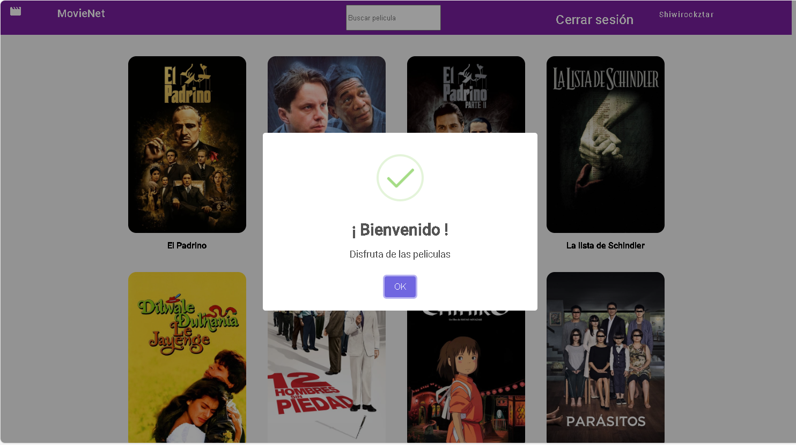

  

  

  

  

  

<h1 align="center"> Angular</h1>

    
  
   
   

## 🔖 Description

- Implement an authentication system that allows users to register, log in and log out.
  log in and log out.
- Create a home page that displays a list of popular movies.
- Allow users to search for movies by title.
- Display details of a selected movie when clicked on.
- Allow users to save movies to their profile when authenticated.
- Create a page in the user's profile where movies saved by the user are displayed.
  user.
- Use routing to navigate between pages.
- Implement an Angular service to connect to the .NET Core backend.
