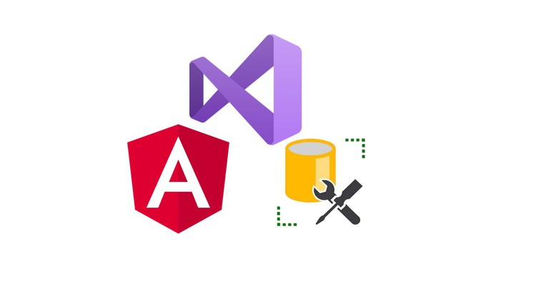

<p align="center">
  
</p>
<h1 align="center">Project Angular .Net and SQL</h1>

<p align="center">With this challenge we by means of this application we build a client to watch movies.</p>

<p align="center">
  <a title="Twitter: Jose_leonardo" href="https://www.linkedin.com/in/jose-leonardo-poveda/">
    
  </a>  
  <a title="Github: Sponsors" href="https://github.com/shiwirockztar">
    
  </a>
  <br />
  <br />
</p>

## 🔖 Description

The candidate must develop a web application that allows users to search for movies
and save them to their profile. The application should be based on Angular for the frontend and .NET
Core 6.0 for the backend. In addition, it should use a public movie API to fetch data from movies.
movie data. An authentication system and a database must be implemented to store user information and saved movies.
store user information and the movies saved by each user.
Recommended movie API, not mandatory: Getting Started (themoviedb.org)
(https://developer.themoviedb.org/reference/intro/getting-started)

Official Documentation: [DotNet | API ](https://learn.microsoft.com/en-us/dotnet/)
Official Documentation: [Angular | Front](https://docs.angular.lat/docs)
Official Documentation: [Swagger | REST API documentation](https://www.youtube.com/watch?v=RayDPBYou4I)
Official Documentation: [MySQL | Database](https://dev.mysql.com/doc/)

## 📌 Methodologies and Guidelines

List of methodologies and tools used in this project for compliance with Quality Assurance Code (QAC)

- ESTlint, tool for identifying and reporting on patterns found in ECMAScript/JavaScript code. \
  [NPM ESLint](https://www.npmjs.com/package/eslint) \
  [NPM ESLint | Airbnb](https://www.npmjs.com/package/eslint-config-airbnb)

## ✅ Prerequisites

In order to work with this project, your local environment must have at least the following versions:

- Dotnet core 6
- Nodejs Version: 18.18.0
- NPM Version: 9.8.1
- Angular Cli 16.2.3
- MySql

## 📐 How to work with this project

You have to do the following steps to be able to work with this project.

## 📂 Code scaffolding

```any
/
├── Backend (.NET Core) 📦  # Main App Server.
├── BackendExe 📦           # App executable.
├── DB (MySQL) 📜           # Sql script.
├── Frontend (Angular) 🌐   # Frontend service interface.
├── assets 🌈               # Images Sources.
├── Readme  📝              # Project information and instructions.
└── ...
```

## ⛽️ Review and Update Dependences

For review and update all npm dependences of this project you need install in global npm package "npm-check-updates" npm module.

```bash
# Install and Run
$npm i -g npm-check-updates
$ncu
```

## Happy Code

Created with JavaScript, lot of ❤️ and a few ☕️

## This README.md file has been written keeping in mind

- [GitHub Markdown](https://guides.github.com/features/mastering-markdown/)
- [Emoji Cheat Sheet](https://www.webfx.com/tools/emoji-cheat-sheet/)
